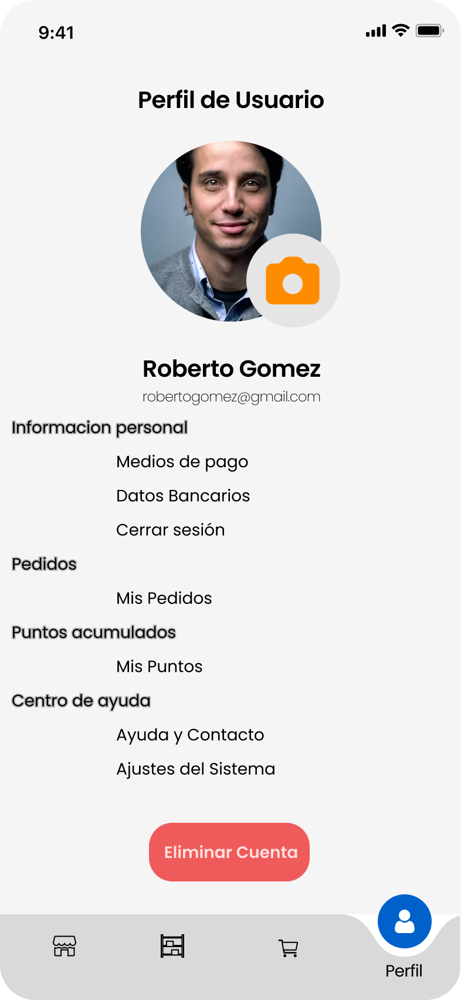

# Proyect LuDiCar HCI

User experience study for Supermarket with a focus on Senior Citizens App
Shopping application for groceries and general items.

## Index

- [1. Introduction](#1-introduction)
- [2. Team](#2-Team)
- [3. Strategy](#3-strategy)
- [4. Solutions Scope](#4-solutions-scope)
- [5. Benchmark](#5-Benchmark)
- [6. Customer Journey Map](#6-customer-journey-map)
- [7. Navigation](#7-Navigation)
- [8. Wireframes](#8-wireframes)
- [9. Mockups](#9-mockups)

---

## 1. Introduction

---

## 2. Team

Luis Perez 

Diego Lopez 

Carlos Moris 

---

## 3. Strategy

---

## 4. Solutions Scope

---

## 5. Benchmark

---

## 6. Customer Journey Map

---

## 7. Mindmap

## 8. Wireframes

---

## 9. Mockups

This section shows the mockups developed as a solution, for a better visualization visit the project in figma together with its functionalities [here](https://www.figma.com/design/wkaun5jrjLOKsvyPtRVLMm/Wireframes-Supermercado-para-Adultos-Mayores?node-id=164-326&t=9XnGG21dCwFHRZB0-1).

Initially, we tried to cover all of our users needs, offering them with all the features needed to satisfy their petitions studied previously. Here are the essentials views that cover these requirements:

Home.

Register Account.

Login.

Main page.

Recommended products.

Product.

Product Extra Info.

Categories

Personalized Package

Shopping Cart

Suggestion Shopping Cart

Transaction details

Shopping History

Post-payment view

User Profile

System Config

Accesibility config
