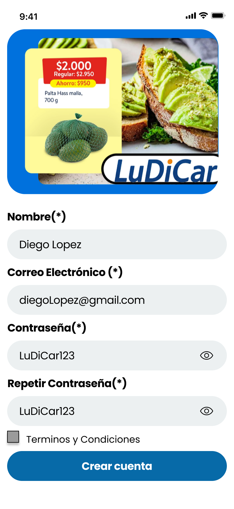

# Proyect LuDiCar HCI

User experience study for Supermarket with a focus on Senior Citizens App
Shopping application for groceries and general items.

## Index

- [1. Introduction](#1-introduction)
- [2. Team](#2-Team)
- [3. Value Proposition Canvas](#3-value-proposition-canvas)
- [4. Solutions Scope](#4-solutions-scope)
- [5. Benchmark](#5-Benchmark)
- [6. Customer Journey Map](#6-customer-journey-map)
- [7. Navigation](#7-Navigation)
- [8. Wireframes](#8-wireframes)
- [9. Mockups](#9-mockups)

---

## 1. Introduction
Grocery shopping can become a difficult task for many seniors due to mobility limitations, cognitive decline, or unfamiliarity with modern technology. While some supermarkets have introduced services like home delivery or self-checkout systems, these solutions often fall short in addressing the unique needs of older adults. Existing supermarket apps and interfaces tend to prioritize speed and efficiency over clarity, accessibility, and ease of use—key factors for aging users.

With this project, we will focus on designing a supermarket experience tailored specifically for seniors. This approach allows us to develop a solution from the ground up, with the goal of deeply understanding and meeting the needs of our end users.

---

## 2. Team

Luis Perez 

Diego Lopez 

Carlos Moris 

---

## 3. Value Proposition Canvas
In this phase, we created a Value Proposition Canvas to better understand what seniors hope to gain from a more accessible supermarket experience and how we can design a solution that addresses their specific challenges, expectations, and daily realities. This tool helped us identify key user pains and gains, allowing us to define a clearer direction for our project from the very beginning.

---

## 4. Solutions Scope
The supermarket experience we designed is primarily tailored for older adults who may face challenges with traditional shopping environments, but it also accommodates younger users who value accessibility, clarity, and a stress-free shopping process. The application is ideal for seniors seeking a more comfortable, guided, and intuitive shopping experience, while also being useful for tech-savvy adults, like our 35-year-old UX persona, who appreciate thoughtful design and efficient navigation. It offers features such as personalized shopping assistance, clearly labeled categories, large readable text, and simplified payment options. Ultimately, it’s a versatile and inclusive solution that aims to improve the grocery shopping experience for users of all ages, with a special focus on the needs of older adults.

---

## 5. Benchmark
To create a solution that truly meets user needs, we conducted a benchmarking analysis of existing supermarket apps and services, especially those aimed at accessibility. This helped us identify both strengths and weaknesses in current offerings, allowing us to learn from their mistakes and adopt successful features. Benchmarking gave us a clearer understanding of market standards and user expectations, helping us design a more inclusive and user-centered shopping experience.

---

## 6. Customer Journey Map
The Customer Journey Map helps us understand how users interact with our supermarket experience, from their first contact to ongoing use. By mapping each stage, we can identify emotions, needs, and pain points—especially those faced by seniors. This insight reveals opportunities to improve the experience, allowing us to design more intuitive, supportive, and meaningful interactions that build trust and satisfaction over time.

---

## 7. Mindmap

## 8. Wireframes
Wireframes are key in planning the structure and layout of our supermarket application. They allow us to visualize the user interface early on, aligning the team around a shared vision before moving into full development. By focusing on user needs—especially those of seniors—we can quickly test ideas, solve problems, and refine the design in a cost-effective way. Wireframes help ensure a clear, intuitive experience from the very beginning.

---

## 9. Mockups

This section shows the mockups developed as a solution, for a better visualization visit the project in figma together with its functionalities [here](https://www.figma.com/design/wkaun5jrjLOKsvyPtRVLMm/Wireframes-Supermercado-para-Adultos-Mayores?node-id=164-326&t=9XnGG21dCwFHRZB0-1).

At first, we aimed to address all identified user needs by incorporating key features based on our prior research. Below are the essential views designed to meet those requirements:

Home.

Register Account.

Login.

Main page.

Recommended products.

Product.

Product Extra Info.

Categories

Personalized Package

Shopping Cart

Suggestion Shopping Cart

Transaction details

Shopping History

Post-payment view

User Profile

System Config

Accesibility config
